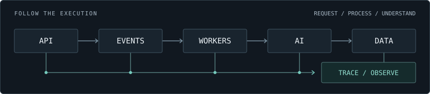

# Chrision Wynaar

**Software Engineer**  
Backend · Distributed Systems · AI

I build to understand what happens between the components: how work moves, where state lives, and why things fail. Each project gives me something I can't explain yet. I keep working until I can, then take on something harder.

<picture>
  <source media="(max-width: 600px)" srcset="assets/hero-system-mobile.svg">
  
</picture>

## 01 / Currently building

### Tekvra

**AI-agent observability & debugging · In development**

Building developer infrastructure to understand why an agent produced the wrong result. The direction: a playground for inspectable runs, trace-based diagnosis, replay, and recurring-failure clusters.

**Design question** — how do you keep evidence separate from a diagnosis?

<!-- Add Tekvra's public repository/demo links here when available. -->

## 02 / Selected systems

### Readiora

**Production · 1,000+ users**

Designed and deployed an AI study platform with PostgreSQL data modeling, authentication, row-level security, and storage. Edge Functions turn uploaded study material into summaries, quizzes, and flashcards.

`Upload` → `Extract` → `Generate`

React · PostgreSQL · Supabase · Edge Functions · OpenAI  
[Explore Readiora →][readiora]

<!-- Add Readiora's public repository link here when available. -->

### Mars Habitat Automation Simulator

**Distributed · Event-driven telemetry**

A simulated habitat with FastAPI services, Kafka messaging, and persistent PostgreSQL state. Dockerized components feed a React/WebSocket dashboard for live telemetry, alerts, and operator controls.

`Telemetry` → `Kafka` → `Dashboard`

FastAPI · Kafka · PostgreSQL · Docker · WebSockets  
[Inspect the repository →][mars]

## 03 / Toolkit

**Languages**

**Backend & distributed systems**

REST APIs · WebSockets · Event-driven architecture

**Data & storage**

SQL · Data modeling · Row-level security

**Frontend**

**Cloud & developer tools**

**AI & search** — OpenAI API · RAG · Embeddings · Vector databases · Text extraction

Currently exploring **OpenTelemetry, agent tracing, and replay systems** through Tekvra.

## 04 / Activity

[Public repositories →][repositories] · [Contributions →][activity]

## 05 / Connect

[LinkedIn][linkedin] · [GitHub][github] · [Email][email]

<!-- Link registry: only confirmed destinations. Native GitHub contributions
     carry activity; there are no external widgets or generated statistics. -->
[readiora]: https://readiora.com
[mars]: https://github.com/Clipzorama/mars_habitat
[repositories]: https://github.com/Clipzorama?tab=repositories
[activity]: https://github.com/Clipzorama?tab=overview
[linkedin]: https://www.linkedin.com/in/chrision-wynaar-7804861a3/
[github]: https://github.com/Clipzorama
[email]: mailto:wchrision@gmail.com
